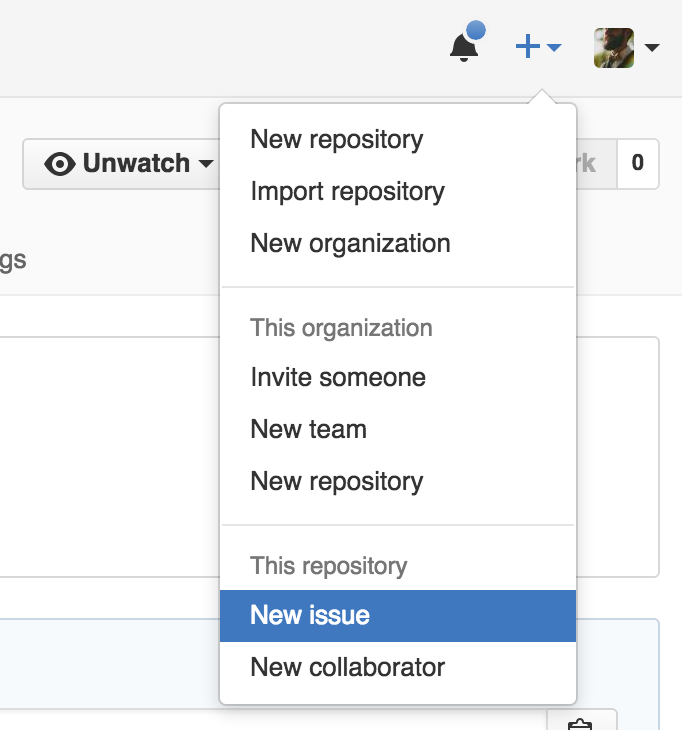
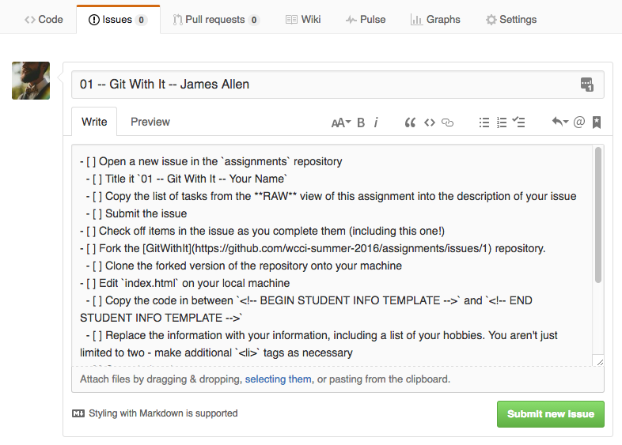
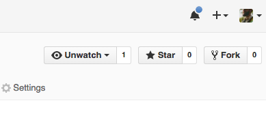

# Git With It

## Overview

Start to get familiar with GitHub by completing some common tasks.

## Tasks

### Required Tasks

- [ ] Open a new issue in the `course-resources` repository
  - [ ] Title it `01 -- Git With It -- Your Name`
  - [ ] Copy the list of tasks from the **RAW** view of this assignment into the description of your issue
  - [ ] Give the issue the label `WIP`
  - [ ] Submit the issue
- [ ] Check off items in the issue as you complete them (including this one!)
- [ ] Fork the [git-with-it](https://github.com/wcci-summer-2016/git-with-it) repository.
  - [ ] Clone the forked version of the repository onto your machine
- [ ] Edit `index.html` on your local machine
  - [ ] Create a new branch before making any edits
  - [ ] Copy the code in between `<!-- BEGIN STUDENT INFO TEMPLATE -->` and `<!-- END STUDENT INFO TEMPLATE -->`
  - [ ] Replace the information with your information, including a list of your hobbies. You aren't just limited to two - make additional `<li>` tags as necessary
  - [ ] Commit the changes to your local copy
  - [ ] Push them up to your forked repository
- [ ] Create a Pull request on the upstream `git-with-it` repository
- [ ] Review someone else's pull request
  - [ ] Approve it if they followed instructions
  - [ ] Leave a comment for them about what to fix if they did not
- [ ] Let us know you're done
  - [ ] Remove the `WIP` label
  - [ ] Add the `Ready for Review` label
  - [ ] Mention the `@staff` team in a comment indicating you're done

### Stretch Tasks

- [ ] Incorporate an image into your student info section
- [ ] Make some changes to the `main.css` file and submit a pull request for that
- [ ] Take a look at additional pull requests and offer feedback

## Details

In this assignment you'll practice a couple workflows that you'll use throughout the cohort. You'll be using GitHub to submit assignments and track your progress on them. You'll also be using GitHub to collaborate with others. Both of these can involve concepts that are a little bit foreign, though hopefully less so soon!

### Open an Issue

First, you'll need to open a new issue in GitHub in the `course-resources` repository.



Give it a title and copy and paste the list of tasks from this document into the description area. You'll need to view this file in **RAW** mode by clicking the **RAW** button to be able to copy the list correctly. It is in a language called `Markdown`, and when you copy it it should look something like this:

```markdown
- [ ] Open a new issue in the `assignments` repository
  - [ ] Title it `01 -- Git With It -- Your Name`
  - [ ] Copy the list of tasks from the **RAW** view of this assignment into the description of your issue
```

If you don't see the symbols like `- [ ]` then you probably aren't in **RAW** mode.



Next, you need to add a label to the issue. Click the **Labels** button on the right side of the screen, and click `WIP` to mark the issue as "Work in Progress."

Finally, submit the issue. As you're working through the homework assignment, revisit the issue page, and click the checkboxes to mark tasks complete.

### Fork the Repository

Next you're going to need to **fork** the `01-git-with-it` repository. Open the [repository](https://github.com/wcci-summer-2016/git-with-it), and click the **Fork** button in the top right.



Forking creates a version of code that you can change to your heart's content without affecting the original code. It is also often used to allow multiple collaborators to work on projects, because forks can have changes **merged** into the original repository. That's what we're going to do with this assignment!

To make changes, you'll need to clone the fork onto your machine. You should use Git Shell to do this.

### Make Edits

Once you've cloned the fork onto your machine, you'll want to create a **branch** to keep track of your changes. It is very common when collaborating with others to put all of your changes in a separate **branch** to make it easier to compare your code to what's known as the `master` **branch**.

To make a new branch, type `git checkout -b my-branch`, replacing `my-branch` with whatever you want to name the branch. Branch names should consist of only lowercase characters, numbers, and dashes. No spaces are allowed! For this project, name your branch with your name. For example, a student named Stefan Reijnders would enter `git checkout -b stefan-reijnders`.

Once you've created your new branch, find the `index.html` file and open it with a text editor. You can use Visual Studio, Atom, Sublime, or any other plain text editor.

You need to add some info about yourself to the `students` area of the file. Look for the comments `<!-- BEGIN STUDENT INFO TEMPLATE -->` and `<!-- END STUDENT INFO TEMPLATE -->`, and copy and paste what's between them to just below the `END` comment, before the `</article>` closing tag.

Change the info in the copy-and-pasted version to reflect some things about yourself. Make sure to check that the link will go to your GitHub page. To preview your changes, you can double-click the `index.html` file to open it in your web browser.

When you have completed the changes, **commit** them using Git Shell. Make sure to write a meaningful but concise commit message describing what you did: e.g., _"Added info for Bernhard Layton"_. Finally push your changes up to GitHub. Note that this should still just be in your **forked** repository.

### Create a Pull Request

A **pull request** is a way of incorporating changes from one person's fork/branch into another fork/branch. It allows for discussion of the changes, and is a common mechanism for contributing to projects. Instead of everybody just editing everyone else's code, pull requests are an opportunity for developers to give feedback on potential changes.

On the GitHub website, go to your forked git-with-it repository page, then click on **Pull requests** at the top, then click on **New pull request**.

For the base fork, choose the `wcci-summer-2016` repository, with the base as `master`. For the head fork, choose your forked repository, and set `compare` to the branch you created.

Click **Create pull request**. You can leave the comments field blank unless you want to explain your reasoning for some changes, then click **Create pull request** one more time.

Do **NOT** click **Merge pull request** for the pull request you just created. Leave that to another student!

### Review Another Pull Request

At this point, you will need to look at the open (unresolved) pull requests on the git-with-it repository (not your fork). Hopefully you will see another student's pull request there. If not, check with the other students and help them get to that point.

Review the code changes. You can click on the **Files changed** tab at the top of the pull request window to see what they have added/removed from the original code. If everything looks good, then go ahead and click the **Merge pull request** button to perform the merge.

It's also possible that the merge will not be able to happen automatically. This is okay, and happens quite often when multiple people work on the same file! In that case, a merge will have to be performed from Git Shell, and files will have to be manually edited before the merge can happen. The GitHub website usually offers some guidance in the event of this happening, and if it happens to you, consider yourself lucky to have a learning opportunity. :)

If it looks to you like they didn't complete the tasks correctly, make note of that by using the commenting functionality of the pull request.

### Update Your Issue

Finally, you'll need to update some parts of your issue to indicate you're complete. First add a comment to your issue with a link to your pull request and a link to the pull request you approved. You can paste a link to the URL of the pull request, or you can also refer to it by typing the `#` sign followed by the automatically assigned number of your pull requests.

Next, adjust the labels by clicking the gear next to the **Labels** link on the right side of the screen. Remove the `WIP` label, and add the `Ready for Review` label.

Finally, add another comment mentioning `@staff` and saying "Completed." This gives us a notification that your assignment has been completed.

### Stretch tasks

Feel free to tackle any of the stretch tasks if you have time. You can incorporate these changes into other pull requests, and if more than one person wants to change the style, we might need to get multiple people involved in the discussion. This is also good!

## Hints

You might have to look up how to clone a repository onto your machine or how to do a number of other tasks for this assignment. I suggest trying to solve the problems on your own using Google or GitHub's help, then seek out other students on Slack, and finally check in with an instructor or TA if you find other students have similar questions. You aren't in this alone - you can code it!
