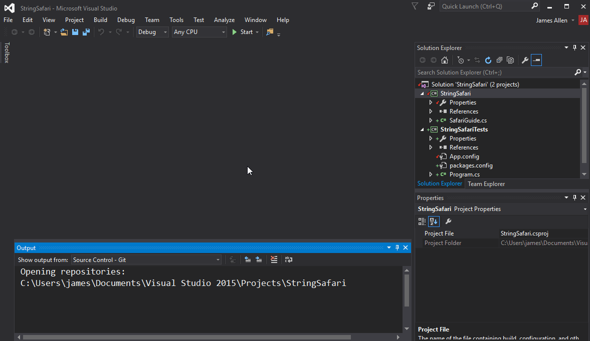
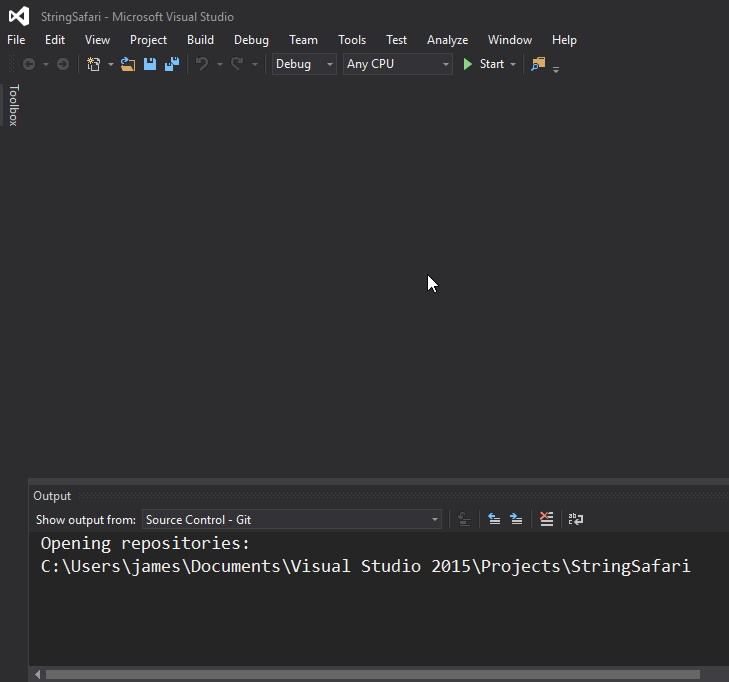

# String Safari

## Overview

Write some methods that will look for certain animals in a string.

## Tasks

### Required Tasks

- [ ] Yak Shaving
  - [ ] Open a new issue called `03 -- String Safari -- Your Name`, and copy/paste these tasks into the description
  - [ ] Fork and clone the [string-safari](https://github.com/wcci-summer-2016/string-safari) repository
  - [ ] Make frequent commits with descriptive messages
- [ ] Systems Check
  - [ ] Verify that the tests run (and many fail) when you click the **Start** button
- [ ] Write `SafariGuide` methods to pass tests
  - [ ] `HasBabyZebra`
  - [ ] `HasAdultZebra`
  - [ ] `HasZebra`
  - [ ] `HasADazzle`
  - [ ] `HasAPride`
  - [ ] `ThereWillBeBlood`
  - [ ] `SafeDistanceToLion`

### Stretch Tasks

- [ ] Write Test(s)
  - [ ] Decide on additional tasks for the safari guide to do
  - [ ] Write tests and skeleton methods
- [ ] Pass Test(s)
  - [ ] Fill in the skeleton methods that will pass the tests

## Details

You are working on some code that will be used for a new robotic safari guide. Someone else wrote some code that will give your robotic guide a string describing the animals (which was no small feat!). It's up to you to help write some methods that will analyze the string and deliver information to trusting tourists.

To make sure the guide will be safe, a QA programmer wrote some automated tests using [NUnit](http://www.nunit.org/). We don't want the robotic guide thinking it's safe when a lion is inches away from the group!

Start by creating a fork of the [string-safari](https://github.com/wcci-summer-2016/string-safari) repository.

To run the tests, you can click the **Start** button after opening the solution in Visual Studio. When you first run the code, you should see that you are managing to pass several of the tests already. Your goal for this assignment is to increase the number of tests that pass to the full number of tests that are run. I recommend running the tests after each major change so you can gauge your progress.

It's possible that, as you are attempting to make some tests pass, others may fail that once passed. This is okay! Just focus on making one test pass at a time. If a test stops passing, then you can revisit it later.

I also encourage you to make a new commit after causing each new test to pass. You can use Git to look at the differences between a version with passing tests and a version with failing tests, and that can sometimes help isolate issues.

### Stretch Tasks

Consider what other sorts of things might be useful for a virtual tour guide to do. Before you write any code to do it, write tests in the `StringSafariTests.cs` file. Take a look at the way the existing test methods are set up using `TestCase` attributes before methods.

Once you have a test method written, write a basic method that will fail the test, then try to make the test pass.

A common cycle when doing **Test Driven Development** (_TDD_) is **red > green > refactor**.

1. Start with a failing test (red)
1. Make it pass (green)
1. Examine your code and determine if there is a better/clearer/more efficient way (refactor)

Properly doing TDD involves writing tests before any actual implementation code is written. It's also great for setting goal posts, and leads to a lot less wondering if your code will actually work!

## Hints

You may want to install the [NUnit 3 Test Adapter](https://github.com/nunit/docs/wiki/Visual-Studio-Test-Adapter) for Visual Studio.

Install it from the `Tools > Extensions and Updates` menu item and restart Visual Studio.

Then show the **Test Explorer** window by clicking `Test > Windows > Test Explorer`, and click the **Run All** button to actually run the tests.

This is not necessary for running tests, and it can take a little bit longer to run tests, but some developers prefer the visualization of each passing/failing test right inside Visual Studio.
