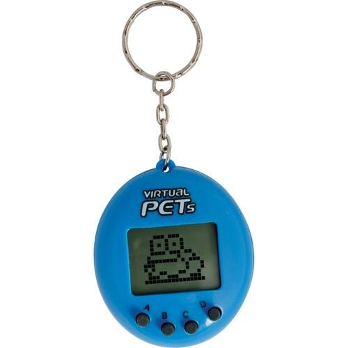

# Virtual Pet

## Overview

Make a virtual pet. Bonus points if it becomes a fad.

## Tasks

### Required Tasks

- [ ] Yak Shaving
  - [ ] Create a console application in Visual Studio called `VirtualPet`
  - [ ] Create a repository called `virtual-pet`
  - [ ] Create a README.md file explaining what this project will involve
- [ ] VirtualPet class
  - [ ] Properties (at least three)
  - [ ] Methods (at least three)
  - [ ] `Tick` method
- [ ] Program class
  - [ ] `Main` method

### Stretch Tasks

- [ ] Give the pet the ability to take care of some of its own needs
- [ ] A visual representation of the pet
- [ ] Calling `Tick` in a separate thread
- [ ] Alternative interfaces

## Details

Make a virtual pet program.



This might seem like a daunting task, but we can break it down.

First, decide what "features" you want to incorporate. You might be tempted to make this a long list - start small! Think MVP!

Next, design a class for the pet. Think of what properties/methods you will need to have for your MVP. Methods might involve things that happen when a person interacts with the pet.

You should plan to include a method called `Tick()` that will update any properties or call time-based methods. The idea behind this method is that every time the menu is shown or some user interaction occurs, you could call the `Tick()` method to cause properties to update. You may want to have some of the properties update randomly to make the virtual pet less predictable.

Some ideas for things that a virtual pet should have (along with some ideas for activities that might address them):

- Hunger (Feed it)
- Thirst (Water it)
- Waste (Let it out to the bathroom)
- Boredom (Play with it)
- Sickness (Take it to the doctor)

Your methods should cause the appropriate properties to update - for instance, if you have a `Feed()` method, it might make `Hunger` go down, but make `Thirst` go up.

Other properties that might update when `Tick` is called:
  - boredom increasing
  - hunger increasing
  - sleepiness increasing

If you play with the pet, perhaps that makes it more tired. Have fun with this part!

Also, remember that more features `!=` better. Pick a focus for your pet. Maybe go with a theme.

Once you've designed the class, it's time to think about the user interface. We're using a Console interface for now, so it will likely involve some sort of loop and a menu showing possible actions, as well as indicating the state of the pet. You'll have to decide when to call the `Tick` method - if you want it to `Tick` every time the menu is shown, or for a stretch task you could explore using a separate thread to have `Tick`s occur automatically every second.

Your user interface should live in the `Main` method of the `Program` class. You should also have a `VirtualPet` class in a separate file.

An example user interface is below (you do not have to make yours match this!):

```
Horace the Hippo
Hunger: 27
Thirst: 5
Boredom: 5
Tiredness: 50

What do you want to do?
1. Feed Horace
2. Water Horace
3. Play with Horace
4. Put Horace to sleep
5. Do nothing

> 1

You feed Horace.
```

### Stretch Tasks

Pets are not robots - they usually have some sort of self-determination! When `Tick` is called, you might want to have your pet take a look at its needs and possibly address one. You could use a random number generator to have it do things randomly, or prioritize things based upon what need is highest. You could also make your pet uncooperative - when the user tries to feed the pet, for example, you might make the pet refuse to eat.

Rather than using numbers to convey your pet's status, you could have some sort of visual representation of the pet. I.e., instead of printing `hunger: 50`, you could use smileys or [ASCII art](https://en.wikipedia.org/wiki/ASCII_art) to show hunger when `hunger >= 50`.
```
     >=<        
,.--'  ''-.
(  )  ',_.'
Xx'xX      

Horace looks like this: :0

1. Feed Horace
2. Water Horace
3. Play with Horace
4. Put Horace to sleep
5. Do nothing
```

Consider exploring threads and how you could have `Tick` occur every second, rather than waiting for user input.

Your `VirtualPet` class could actually be usable with a completely different interface, such as a web page or a phone app. You might want to explore how you could use it elsewhere.

## Hints

Don't try to tackle everything at once! Break this project up into smaller chunks, and you will find that they are all manageable.
