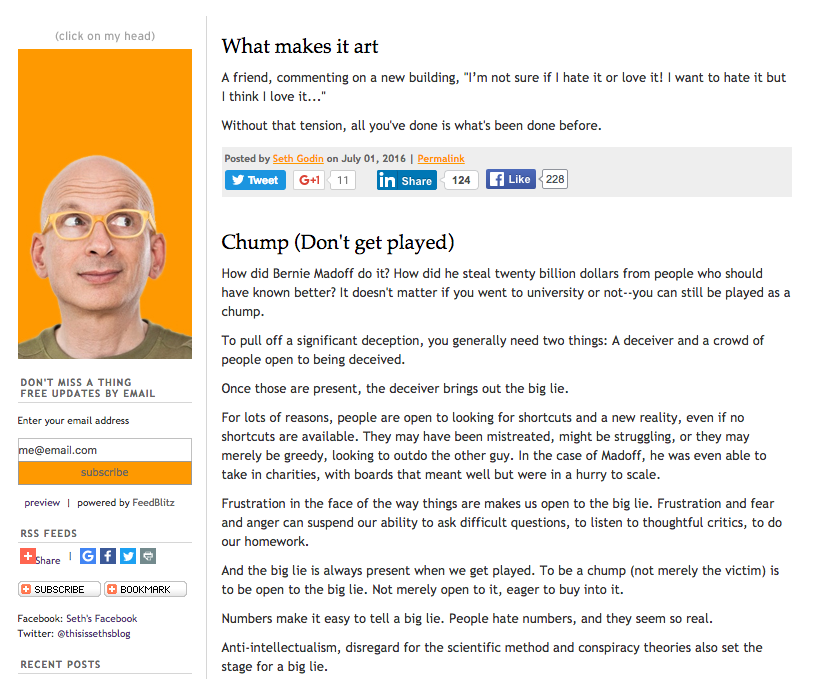
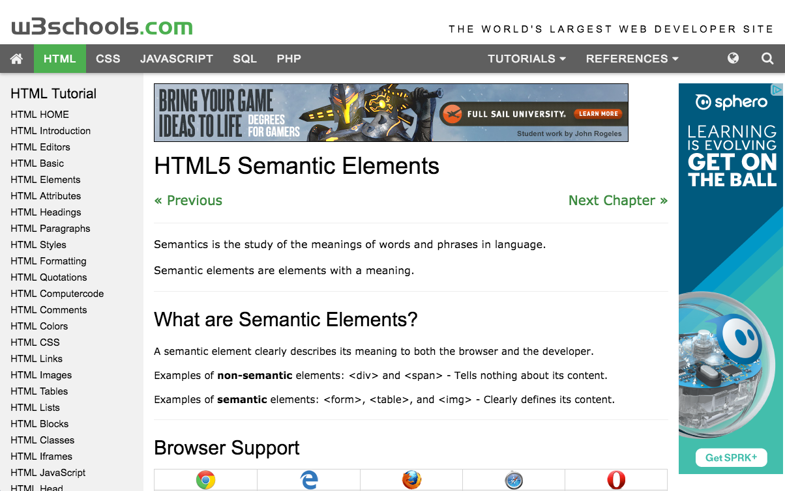

# Structure

## Overview

Write the HTML for some websites, focusing on picking appropriate elements to emphasize the structure of the document.

## Tasks

### Required Tasks

- [ ] Yak Shaving
  - [ ] (OPTIONAL) Create a Visual Studio **Web Site** project called `structure`
  - [ ] Create a repository called `structure`
  - [ ] Make frequent commits with descriptive messages
- [ ] Barebones HTML
  - [ ] Blog Site (`blog.html`)
  - [ ] Tutorial Site (`tutorial.html`)

### Stretch Tasks

- [ ] News Site (`news.html`)
- [ ] Shopping Site (`shopping.html`)

## Details

For this assignment, you will be recreating the overall structure of some existing websites. You are _not_ going to be focusing on the look of them, though - instead, you're going to focus on the **structure**.

The structure of a document is determined by the HTML tags (elements) that make it up. In HTML5, much more emphasis is placed on using appropriate _semantic_ elements: that is, elements that convey some sense of how their contents fit with the rest of the content on the page.

Do not focus on what the page _looks_ like - instead, focus on what the parts of the page are intended to _convey_. In fact, feel free to use placeholder text anywhere there is an image or large blobs of text. Use the toolbox for ideas of tags to use.

Also don't get bogged down in the exact content - try to convey the gist of what the page is showing, but don't feel like you have to re-type _every single thing_ on it. The point of this assignment is to focus on the structure, not the content.

For each task, it might help to draw boxes around key areas and connect related areas.

### Toolbox

Here are some suggestions for tags to use. You aren't limited to these, but you should be able to complete the required tasks using these:

* `<!DOCTYPE html>`
* `<html>`
* `<head>`
* `<body>`
* `<header>`
* `<nav>`
* `<main>`
* `<article>`
* `<section>`
* `<aside>`
* `<footer>`
* `<h1>`...`<h6>`
* `
`
* `<ul>` and `<li>`
* `<ol>` and `<li>`
* ``
* `<table>`
* `
`

### Blog Site

### Tutorial Site

### Stretch Tasks

Work on these additional layouts. These aren't necessarily more complex layouts - remember to focus on the information that needs to be conveyed, and trust that positioning/sizing can largely be handled with CSS!

#### News Site

#### Shopping Site

## Hints

Your HTML pages will LOOK very different than the screenshots, but the content should be accessible in a similar way.

If you want to get some filler text, you can visit [Lipsum.com](http://www.lipsum.com/), or get some local flavor from [Cleveland Ipsum](http://localipsum.meyerweb.com/).

You can use Visual Studio to work on these files. One of the simplest ways is to create a new **Web Site** project.

Go to `File` > `New` > `Website`, and choose `ASP.NET Empty Web Site` as your starting point. Give the project a name.

To add files to your project, right click on the project in **Solution Explorer** and choose `Add` > `Add New Item`, and choose `HTML Page` as the item type.

You can view your files in a web browser by clicking the green `>` button at the top of Visual Studio.
