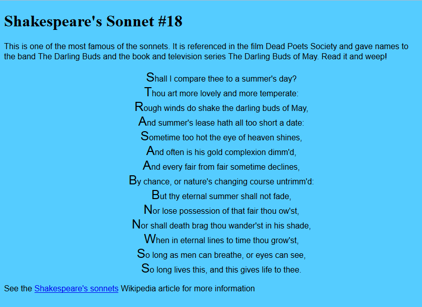
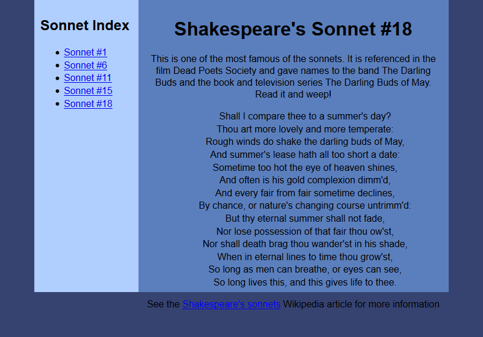

# Never Go Out

## Overview

Write the CSS for some webpages, focusing on writing the cleanest CSS rules that will achieve the desired visual result.

## Tasks

### Required Tasks

- [ ] Yak Shaving
  - [ ] Fork the [never-go-out](https://github.com/wcci-summer-2016/never-go-out) repository
  - [ ] Make frequent commits with descriptive messages
- [ ] Sonnet # 18 version 1 (dark blue)
- [ ] Sonnet # 18 version 2 (light blue)
- [ ] Sonnet # 18 version 3 (burlywood)

### Stretch Task

- [ ] Sonnet 2-column layout

## Details

In this assignment you will be focusing on writing CSS to achieve some specific layouts. These might not be prize-winning designs, but they should at least help you flex your styling muscles.

### Dark Blue

The first task only involves changing fonts and colors - no layout or other more advanced CSS here! Use the HTML in `sonnet18.html`, but only change things in the `<head>`.

Hints:
- You'll need to link your HTML to a new stylesheet. Call this new stylesheet `darkblue.css`
- You can use the following fonts list for help: http://www.w3.org/Style/Examples/007/fonts
- Don't worry if your text doesn't wrap at the same word -- it will depend on the size of your browser window.

### Light Blue

This second challenge will build upon your text formatting skills, as well as start using margins and padding. Continue to use `sonnet18.html`, but point it at a different stylesheet called `lightblue.css`.

Hints:
- This challenge requires you to create a fixed-width layout that is centered in the browser window.
- To get the `main` element to stay centered, you'll need to set the left and right margins to `a_t_` (you've got to fill in the blanks).

### Burlywood

This builds upon the techniques from the previous task. Continue to work with `sonnet18.html`, and call your stylesheet `burlywood.css`.

If you can improve on the design (shouldn't be too hard!), great! Make sure you're able to at least get the style pieces in this image first, though.

Hints:
- Check out the `border` properties!

### Toolbox

Here are some suggestions for CSS things to use. You aren't limited to these, but you should be able to complete the required tasks using these:

Properties:
- `font-family`
- `font-size`
- `font-weight`
- `font-style`
- `color`
- `background-color`
- `text-decoration`
- `border-style`
- `border-width`
- `border-color`
- `margin`
- `padding`
- `line-height`
- `float` (for stretch task)

Pseudoselectors/pseudoelements:
- `::first-letter`

### Stretch Task: Two Column Layout

This one will get you fiddling with margins and padding! Start with `manysonnets.html`, and link it to a stylesheet called `twocolumn.css`.

Hints:
- You'll need to set a fixed width for your `main`, and then float the `nav`.
- You may also want to fiddle with widths/margins of the `nav` and `article` elements!

## Hints

You may find it helpful to play [this song](https://www.youtube.com/watch?v=-CmadmM5cOk) while working on this project.

You should be able to get your pages _very_ close to the screenshots with the power of CSS. If you want to get the colors **exactly**, you can use a color picker tool. A nice, small free one is available at http://www.colorschemer.com/colorpix_info.php. Note that this is just a `.exe` file you can run without any installation!

This assignment is adapted from https://en.wikiversity.org/wiki/Web_Design/CSS_challenges.
