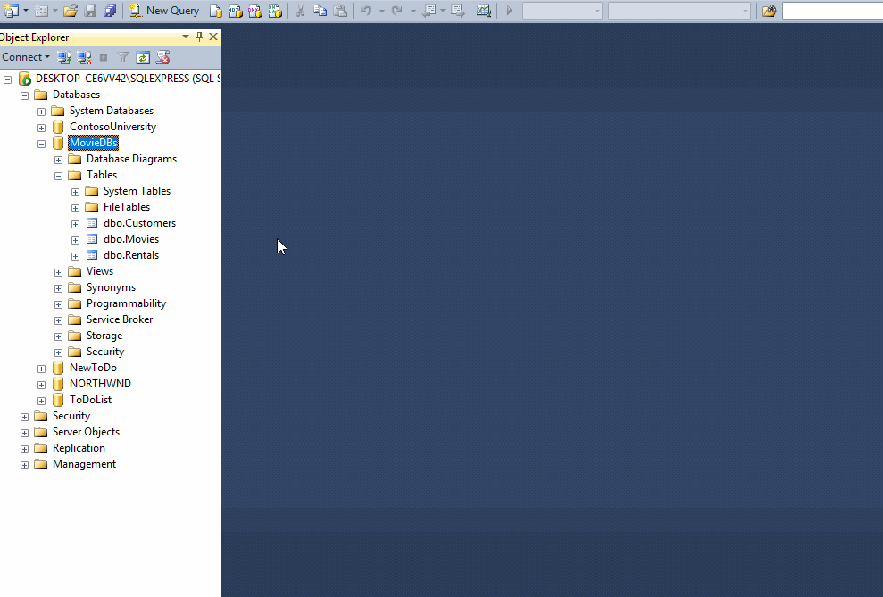

# Summer School MVC

## Overview

Create a SQL database and table(s) to represent enrollment information for a summer school program, and create the Visual Studio MVC project to allow you to work with the information in the database.

## Tasks

### Required Tasks

- [ ] Yak Shaving
  - [ ] Create a Visual Studio project named `summer-school-mvc`
  - [ ] Make frequent commits with descriptive messages
- [ ] Database Design
  - [ ] Create a database called `SummerSchoolMVC`
  - [ ] Create the `Students` table
    - [ ] `StudentID`
    - [ ] `FirstName`
    - [ ] `LastName`
    - [ ] `EnrollmentFee`
  - [ ] Generate the SQL for the database schema
- [ ] Link Database with Project
  - [ ] Add model linked to database
  - [ ] Add a controller for `Students`
  - [ ] Add a link to the Home/Index view to access the `Students` controller
  - [ ] Add the database schema `SQL` file to your project

### Stretch Tasks

- [ ] Spruce up your view files

## Details

For this assignment, you will go through the process of creating a SQL database, creating an MVC project, and linking them together. This is known as the "database first" method of developing a site. We will focus on a problem that we have already solved using a console application: the Summer School project. We won't worry about applying the logic associated with enrollment yet, we will just focus on storing the data.

Start by creating a new project in Visual Studio that is an **ASP.NET Web Application** using the **MVC** template.

Then in SQL Server Management Studio, design your database. Make sure to create a new database for this project called `SummerSchoolMVC`, then create a table for `Students`. Make sure it has appropriate columns with appropriate data types.

Back in Visual Studio, you need to link the database to your project. Do this by first adding a new **ADO.Net entity data model** using **EF Designer from Database**, selecting your database as the data source.

After confirming that your table is showing up in the Entity Framework designer, create a controller.

Next, open up the `Index.cshtml` file in the `Views/Home` folder. Add a link to your new controller in this file and test out your controller!

Lastly, you need to export your database schema. This can be done from SQL Server Management Studio by right-clicking on the database, choosing `Tasks` > `Generate scripts`.

Save the SQL file to your project folder and make sure it is committed to your repository using `git add` and `git commit`.

### Stretch Tasks

Explore the `cshtml` files that make up your application and make them look a little bit better. The `Shared/_Layout.cshtml` is included on every page of your site, and the `Content/Site.css` file lets you easily include CSS customizations beyond Bootstrap.

## Hints

This homework assignment is _very similar_ to the task you did this morning, with a simpler database schema. You will not be worrying about how to calculate the enrollment fee today - for now, just worry about getting the database and basic controller actions set up!
